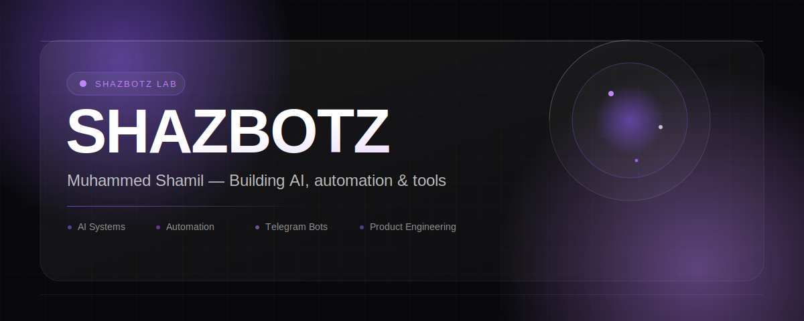
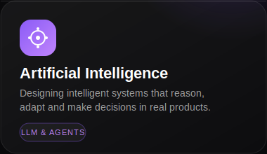
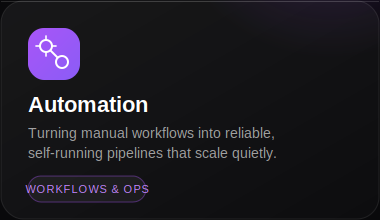
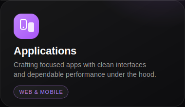
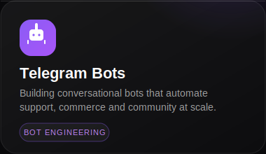
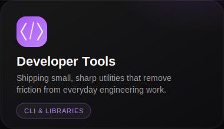

 

 

<!-- ABOUT -->
<h2 align="center">About</h2>

  
  &nbsp;<b>SHAZBOTZ</b> is the studio behind everything I build.

I'm <b>Muhammed Shamil</b>, the person behind <b>SHAZBOTZ</b> — a small, focused practice built around one idea: software should feel considered, not assembled. I work across <b>AI systems</b>, <b>automation</b>, <b>Telegram bots</b>, and <b>developer tools</b>, shaping each one with the same attention a product team would give a flagship release, even when the audience is just a handful of people who need it to work perfectly.

Every project under this name shares a philosophy: fewer moving parts, clearer interfaces, and decisions that hold up under real use. If it ships under SHAZBOTZ, it's been thought through — from the first API call to the last pixel.

 

 

<!-- CONTACT BUTTONS -->
<h2 align="center">Get in Touch</h2>

&nbsp;

  

&nbsp;

 

 

<!-- WHAT I BUILD -->
<h2 align="center">What I Build</h2>

Five disciplines, one standard of craft.

 

&nbsp;

  

&nbsp;

  

 

 

<!-- STACK / FOCUS -->
<h2 align="center">Focus Areas</h2>

&nbsp;&nbsp;&nbsp;
&nbsp;&nbsp;&nbsp;
&nbsp;&nbsp;&nbsp;
&nbsp;&nbsp;&nbsp;

  

AI &amp; LLM Systems &nbsp;·&nbsp; Automation &amp; Workflows &nbsp;·&nbsp; Web &amp; Mobile Apps &nbsp;·&nbsp; Telegram Bots &nbsp;·&nbsp; Developer Tools

 

<!-- PHILOSOPHY -->
<h2 align="center">How I Work</h2>

<table align="center" width="90%">
<tr>
<td width="33%" valign="top" align="center">

 <b>Precision over noise</b>
 Every feature earns its place, or it doesn't ship.
</td>
<td width="33%" valign="top" align="center">

 <b>Systems, not scripts</b>
 Built to run unattended and fail gracefully.
</td>
<td width="33%" valign="top" align="center">

 <b>Intelligence with intent</b>
 AI as a tool for judgment, not just automation.
</td>
</tr>
</table>

 

